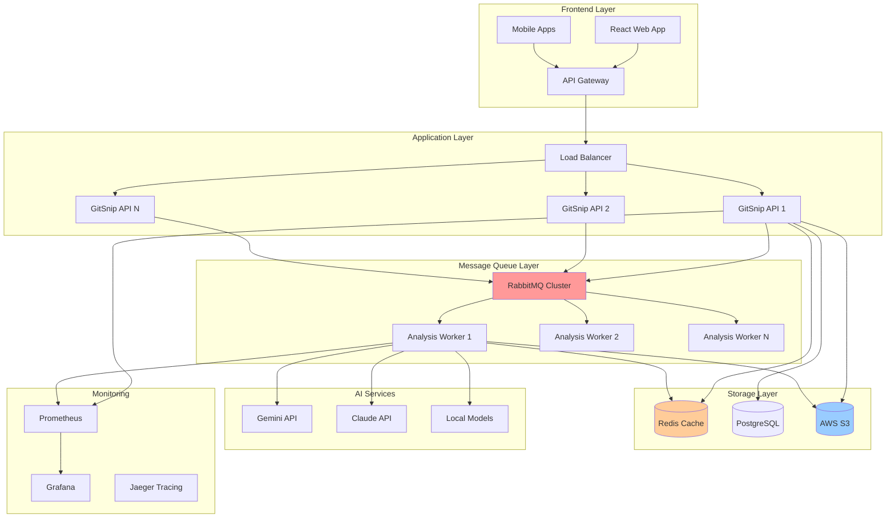

# GitSnip

**Turning complex codebases into accessible stories**

[](https://youtu.be/p7L3rP_ZJHg)

 
Automatically generate comprehensive, step-by-step tutorials from any codebase using AI.

## 🤔 About

Understanding large, complex real-world projects is often a developer's nightmare. With minimal documentation and intricate codebases, onboarding to new projects can take weeks of frustrating effort. After repeatedly facing this challenge throughout my career, I realized this widespread problem needed a solution.

That's why I created **GitSnip** - a tool that transforms impenetrable codebases into comprehensible narratives. GitSnip intelligently crawls through entire repositories and generates beautifully structured, story-based explanations of how the code works, complete with detailed explanations, relevant code blocks, and intuitive flow diagrams. What once took days or weeks to grasp can now be understood in hours, making the process of learning a new codebase as enjoyable as reading a well-crafted "lore" rather than a technical chore.

While initially inspired by a basic codebase knowledge generator example from PocketFlow (a 100-line minimalist LLM framework designed for building AI agent workflows), GitSnip represents a complete reimagining of the concept. I've developed advanced capabilities to handle genuinely complex, large-scale projects through sophisticated embedding-based clustering, intelligent content chunking, and cross-reference handling. These enhancements transform the concept from an interesting demo into a powerful tool capable of tackling real-world enterprise codebases that previously required extensive time and expertise to understand.

## 🚀 Features

### Core Analysis Features
-   📚 **Automated Tutorial Creation**: Generates multi-chapter Markdown tutorials from source code
-   🧠 **AI-Powered Analysis**: Leverages LLMs (Gemini) to identify core abstractions and relationships within the code
-   🔗 **Code Connectivity**: Understands how different parts of the codebase interact
-   📈 **Visual Structure**: Creates Mermaid diagrams to visualize project architecture and component relationships
-   ✨ **Diagram Validation & Fixing**: Automatically validates and attempts to fix generated Mermaid diagrams using `mmdc`
-   📂 **Flexible Input**: Works with both local directories and public/private GitHub repositories
-   🔍 **Large Codebase Handling**: Uses embedding and clustering techniques for codebases exceeding LLM context windows
-   🌐 **Language Support**: Generate tutorials in different languages (via `--language` flag, applies to generated text)
-   ⚙️ **Configurable**: Filter files using include/exclude patterns and set maximum file size limits

### Web Application Features
-   🎨 **Modern React Frontend**: Beautiful, responsive web interface with Tailwind CSS
-   🔄 **5-Step Workflow**: Repository → Configuration → Authentication → Processing → Results
-   📊 **Real-time Progress**: Live progress tracking with detailed status updates
-   🔐 **Security**: Encryption for private repository analysis results
-   📱 **Responsive Design**: Works perfectly on desktop and mobile devices
-   ⚡ **One-Command Deployment**: Deploy anywhere with Docker in seconds

## ⚙️ Tech Stack

### Backend
-   🐍 **Python 3**: Core analysis engine
-   🌊 **PocketFlow**: Workflow orchestration
-   🤖 **Google Gemini API**: AI-powered code analysis
-   🐙 **PyGithub**: GitHub repository integration
-   📊 **Mermaid.js**: Diagram generation and validation
-   🔧 **Flask**: REST API server
-   🔐 **Cryptography**: Secure encryption for private repos

### Frontend
-   ⚛️ **React 18**: Modern UI framework
-   🎨 **Tailwind CSS**: Utility-first styling
-   🧩 **shadcn/ui**: Professional component library
-   ⚡ **Vite**: Fast development and building
-   🎯 **Lucide React**: Beautiful icons

### Deployment
-   🐳 **Docker**: Containerized deployment
-   🌐 **Nginx**: Production web server
-   📦 **Docker Compose**: Multi-service orchestration

## 🚀 Quick Start (Recommended)

### Option 1: One-Command Deployment 🎯

The fastest way to get GitSnip running:

```bash
# Clone the repository
git clone https://github.com/texorn/gitsnip.git
cd gitsnip

# Run the interactive deployment script
./deploy.sh
```

The script will guide you through deployment options:
1. **Frontend Only** - Quick demo with simulated backend
2. **Full Stack** - Complete application with real analysis
3. **Production** - Production-ready setup with reverse proxy

## 🚀 Quick Start

### Option 1: One-Command Deployment (Recommended)

```bash
# Clone the repository
git clone https://github.com/texorn/gitsnip.git
cd gitsnip

# Run the interactive deployment script
./deploy.sh
```

The deployment script will:
- ✅ Install Docker and Docker Compose if needed
- ✅ Set up user permissions for Docker
- ✅ Create environment configuration
- ✅ Offer multiple deployment options:
  1. **Frontend Only** (Docker) - Just the web interface
  2. **Full Stack** (Docker) - Complete application with backend
  3. **Development Mode** - No Docker, for development

**Access your application:**
- **Frontend**: http://localhost:8000 (Docker) or http://localhost:5173 (Dev)
- **Backend API**: http://localhost:4000
- **Health Check**: http://localhost:4000/health

### Option 2: Manual Docker Deployment

```bash
# Clone and navigate
git clone https://github.com/texorn/gitsnip.git
cd gitsnip

# Create environment file
cp .env.example .env
# Edit .env with your API keys

# Deploy full stack
docker-compose --profile fullstack up -d --build

# Or deploy frontend only
docker-compose --profile frontend up -d --build
```

## 🎯 Analysis Modes

GitSnip offers two analysis modes to suit different needs:

### 🚀 Fast Analysis Mode
- **Speed**: Lightning fast analysis using Gemini 2.5 Flash-Lite Preview
- **Limit**: Analyzes up to 5 files maximum
- **API Key**: Uses built-in API key (no setup required)
- **Best for**: Quick overviews, small projects, rapid prototyping

### 🔬 Detailed Analysis Mode
- **Depth**: Comprehensive analysis of entire codebase
- **Limit**: No file limit restrictions
- **API Key**: Requires your own Gemini API key
- **Best for**: Large projects, thorough documentation, production use

**Getting a Gemini API Key:**
1. Visit [Google AI Studio](https://aistudio.google.com/app/apikey)
2. Create a new API key
3. Enter it in the "Detailed Analysis" mode in GitSnip
## 🛠️ Development Setup

### Prerequisites

- **Docker & Docker Compose** (recommended)
- **Node.js 20+** and **pnpm** (for frontend development)
- **Python 3.11+** (for backend development)
- **Git** (for cloning)

### Quick Development Start

```bash
# Clone the repository
git clone https://github.com/texorn/gitsnip.git
cd gitsnip

# Use the deployment script for development mode
./deploy.sh
# Select option 3: "Development Mode (No Docker)"
```

This will automatically:
- Set up Python virtual environment
- Install all dependencies
- Start backend on port 4000
- Start frontend on port 5173 (or next available)
- Handle all configuration

### Manual Development Setup

#### Frontend Development

```bash
# Navigate to frontend
cd frontend/react-app

# Install dependencies
pnpm install

# Start development server
pnpm run dev --host
# Access at: http://localhost:5173
```

#### Backend Development

```bash
# Create virtual environment
python3 -m venv venv
source venv/bin/activate  # On Windows: venv\Scripts\activate

# Install dependencies
pip install -r requirements.txt
pip install flask flask-cors cryptography

# Set environment variables
export GEMINI_API_KEY="your_gemini_api_key_here"
export GITHUB_TOKEN="your_github_token_here"  # Optional

# Run the API server
python api_server.py
# API available at: http://localhost:4000
```

### Command Line Usage

For direct command-line usage without the web interface:

```bash
# Activate virtual environment
source venv/bin/activate

# Install Mermaid CLI (requires Node.js)
npm install -g @mermaid-js/mermaid-cli

# Analyze a local directory
python main.py --dir /path/to/your/codebase -i "*.py" -o ./output-directory

# Analyze a GitHub repository
python main.py --repo https://github.com/owner/repo -i "*.ts" -o ./output-directory

# For private repositories, clone first then use --dir
git clone https://github.com/owner/private-repo.git
python main.py --dir ./private-repo -i "*.js" -o ./output-directory
```

## 🌐 VPS Deployment

Deploy GitSnip on any VPS (Hostinger, DigitalOcean, AWS, etc.):

### Step 1: Server Setup

```bash
# Connect to your VPS
ssh root@your-server-ip

# Update system
apt update && apt upgrade -y

# Install Docker
curl -fsSL https://get.docker.com -o get-docker.sh
sh get-docker.sh

# Install Docker Compose
apt install docker-compose-plugin -y
```

### Step 2: Deploy GitSnip

```bash
# Clone repository
git clone https://github.com/texorn/gitsnip.git
cd gitsnip

# Create environment file
cp .env.example .env
nano .env  # Edit with your API keys

# Deploy with interactive script
./deploy.sh
```

### Step 3: Configure Firewall

```bash
# Allow HTTP/HTTPS traffic
ufw allow 80
ufw allow 443
ufw allow 22  # SSH
ufw enable
```

### Step 4: Domain Setup (Optional)

Point your domain to the VPS IP and update nginx configuration:

```bash
# Edit nginx config
nano nginx-proxy.conf

# Change server_name from localhost to your domain
server_name your-domain.com;

# Restart services
docker-compose restart
```

## ⚙️ Configuration

### Environment Variables

Create a `.env` file in the project root:

```bash
# API Keys (Required)
GEMINI_API_KEY=your_gemini_api_key_here
GITHUB_TOKEN=your_github_token_here

# Application Settings
NODE_ENV=production
FLASK_ENV=production

# Ports (Optional - change if needed)
FRONTEND_PORT=80
BACKEND_PORT=5000
PROXY_PORT=8080

# Domain (For production)
DOMAIN=your-domain.com
```

### API Keys Setup

1. **Gemini API Key**: Get from [Google AI Studio](https://aistudio.google.com/app/apikey)
2. **GitHub Token**: Generate from [GitHub Settings](https://github.com/settings/tokens)
   - Required permissions: `repo` (for private repos), `public_repo` (for public repos)

## 🔐 Security Features

### Private Repository Protection

GitSnip includes advanced security features for private repository analysis:

- **🔒 Encryption**: Results encrypted using your GitHub token as the key
- **🛡️ No Plain Text Storage**: Private repo analysis never stored unencrypted
- **🔑 Token Verification**: Only you can decrypt your results
- **🗑️ Auto Cleanup**: Unencrypted files automatically removed
- **📥 Secure Downloads**: Encrypted archives for private repo results

### Security Flow

1. **Private Repo Detected** → Automatic encryption enabled
2. **Analysis Complete** → Results encrypted with your GitHub token
3. **View Results** → Click "View Results" to decrypt with your token
4. **Download** → Secure download with token authentication

## 📊 Usage Examples

### Web Interface

1. **Open GitSnip** in your browser (http://localhost after deployment)
2. **Enter Repository URL** (e.g., `https://github.com/facebook/react`)
3. **Configure Analysis** (file patterns, size limits, language)
4. **Authenticate** (GitHub token for private repos)
5. **Monitor Progress** (real-time updates)
6. **View Results** (comprehensive analysis with download option)

### Command Line

```bash
# Analyze a Python project
python main.py --repo https://github.com/django/django \
  --include "*.py" \
  --exclude "*/tests/*" \
  --max-file-size 50000 \
  --language english \
  --output ./django-analysis

# Analyze a JavaScript project
python main.py --dir ./my-react-app \
  --include "*.js,*.jsx,*.ts,*.tsx" \
  --exclude "node_modules/*,build/*" \
  --output ./react-analysis

# Analyze with custom settings
python main.py --repo https://github.com/microsoft/vscode \
  --include "*.ts,*.js" \
  --exclude "*/test/*,*/node_modules/*" \
  --max-file-size 100000 \
  --language spanish \
  --output ./vscode-analysis
```

## 🔧 Management Commands

### Docker Management

```bash
# View logs
docker-compose logs -f

# Stop services
docker-compose down

# Update application
git pull origin main
docker-compose down
docker-compose up -d --build

# View service status
docker-compose ps

# Monitor resources
docker stats
```

### Health Checks

```bash
# Frontend health
curl http://localhost/health

# Backend health
curl http://localhost:5000/health

# Check all services
./deploy.sh  # Choose option 6 (Show Status)
```

## 🔍 Troubleshooting

### Common Issues

#### Port Already in Use
```bash
# Check what's using the port
sudo lsof -i :80

# Change port in docker-compose.yml or kill the process
```

#### Permission Denied
```bash
# Add user to docker group
sudo usermod -aG docker $USER

# Logout and login again
```

#### Out of Disk Space
```bash
# Clean up Docker
docker system prune -a

# Remove unused volumes
docker volume prune
```

#### Analysis Takes Too Long
- Large codebases can take 2-3 hours or more
- Consider using file filters to reduce scope
- Check API rate limits (try Gemini 2.5 Pro Preview)
- Monitor progress in the web interface

### Getting Help

1. Check the [troubleshooting section](#troubleshooting)
2. View logs: `docker-compose logs -f`
3. Check service status: `./deploy.sh` → option 6
4. Open an issue on GitHub with logs and error details

## 📝 Output Structure

GitSnip generates comprehensive documentation:

```
output-directory/
├── Project_Name/
│   ├── README.md              # Main tutorial with table of contents
│   ├── 01_component_name.md   # Individual component chapters
│   ├── 02_another_component.md
│   ├── ...
│   └── diagrams/              # Generated Mermaid diagrams
│       ├── overview.mmd
│       └── component_*.mmd
```

### Viewing Results

- **Web Interface**: Results displayed with syntax highlighting and download option
- **Local Files**: Use VSCode with "Markdown Preview Enhanced" extension
- **Command Line**: Navigate to output directory and open `README.md`

## 🤝 Contributing

Contributions are welcome! Here's how to get started:

1. **Fork the repository**
2. **Create a feature branch**: `git checkout -b feature/amazing-feature`
3. **Make your changes** and test thoroughly
4. **Commit your changes**: `git commit -m 'Add amazing feature'`
5. **Push to the branch**: `git push origin feature/amazing-feature`
6. **Open a Pull Request**

### Development Guidelines

- Follow existing code style and conventions
- Add tests for new features
- Update documentation as needed
- Test Docker deployment before submitting

## 📄 License

This project is licensed under the MIT License - see the [LICENSE](LICENSE) file for details.

## 🙏 Acknowledgements

-   Built using the excellent [PocketFlow](https://github.com/The-Pocket/pocketflow) library
-   Powered by Google's [Gemini](https://deepmind.google.com/technologies/gemini/) models
-   Diagrams created with [Mermaid.js](https://mermaid.js.org/)
-   UI components from [shadcn/ui](https://ui.shadcn.com/)
-   Icons from [Lucide](https://lucide.dev/)

## 🚀 What's New

### Recent Updates

- ✅ **React Frontend**: Modern web interface with beautiful UI
- ✅ **Docker Deployment**: One-command deployment anywhere
- ✅ **Security Features**: Encryption for private repository analysis
- ✅ **Real Backend Integration**: No more placeholders - real GitSnip analysis
- ✅ **VPS Ready**: Deploy on Hostinger, DigitalOcean, AWS, etc.
- ✅ **Production Ready**: Health checks, monitoring, reverse proxy

### Next Steps & Optimizations

#### 🏗️ **Infrastructure & Scalability**

**Storage & Data Management:**
- 🗄️ **S3 Integration**: Move analysis results to AWS S3 for scalable storage
  - Implement presigned URLs for secure file access
  - Add lifecycle policies for cost optimization
  - Enable versioning for analysis history
- 📊 **Database Layer**: Add PostgreSQL/MongoDB for metadata and user management
- 🔄 **CDN Integration**: CloudFront/CloudFlare for faster global content delivery

**Message Queue & Processing:**
- 🐰 **RabbitMQ Integration**: Implement message queues for batch processing
  - Separate queues for fast vs detailed analysis
  - Dead letter queues for failed jobs
  - Priority queues for premium users
- ⚡ **Worker Scaling**: Auto-scaling worker nodes based on queue depth
- 🔄 **Background Jobs**: Async processing with job status tracking

#### 🚀 **Performance Optimizations**

**Caching & Speed:**
- 🏃 **Redis Caching**: Cache analysis results and repository metadata
- 📦 **Repository Caching**: Smart caching of cloned repositories
- 🔍 **Incremental Analysis**: Only analyze changed files in updates
- 🧠 **Embedding Cache**: Store and reuse code embeddings

**API & Backend:**
- 🔄 **Rate Limiting**: Implement intelligent rate limiting per user/IP
- 📊 **Load Balancing**: Multiple backend instances with load balancer
- 🔧 **Connection Pooling**: Database and API connection optimization
- 📈 **Monitoring**: Prometheus + Grafana for performance metrics

#### 🎯 **User Experience & Features**

**Advanced Analysis:**
- 🔍 **Diff Analysis**: Compare codebases between versions/branches
- 🏷️ **Smart Tagging**: Auto-categorize repositories by technology stack
- 📊 **Complexity Metrics**: Code complexity and maintainability scores
- 🔗 **Dependency Mapping**: Visualize external dependencies and vulnerabilities

**Collaboration & Sharing:**
- 👥 **Team Workspaces**: Shared analysis results for teams
- 💬 **Comments & Annotations**: Collaborative notes on analysis
- 📤 **Export Options**: PDF, Word, Confluence integration
- 🔗 **Public Galleries**: Showcase interesting analysis results

#### 🔐 **Enterprise & Security**

**Authentication & Authorization:**
- 🔐 **SSO Integration**: SAML, OAuth2, LDAP support
- 👤 **User Management**: Role-based access control (RBAC)
- 🏢 **Organization Support**: Multi-tenant architecture
- 📊 **Usage Analytics**: Per-user/organization usage tracking

**Security Enhancements:**
- 🛡️ **Vulnerability Scanning**: Integrate with security tools
- 🔒 **End-to-End Encryption**: Encrypt analysis data at rest and in transit
- 📋 **Audit Logging**: Comprehensive audit trails
- 🔍 **Content Filtering**: Prevent analysis of sensitive data

#### 🤖 **AI & Intelligence**

**Model Improvements:**
- 🧠 **Multi-Model Support**: Claude, GPT-4, local models
- 🎯 **Specialized Models**: Fine-tuned models for specific languages
- 🔄 **Model Routing**: Intelligent model selection based on code type
- 📊 **Quality Scoring**: AI-powered analysis quality assessment

**Advanced Features:**
- 🎨 **Code Visualization**: Interactive code flow diagrams
- 🔍 **Semantic Search**: Search codebases by functionality
- 💡 **Improvement Suggestions**: AI-powered refactoring recommendations
- 📚 **Learning Paths**: Generate learning curricula from codebases

#### 📱 **Platform & Integration**

**Multi-Platform:**
- 📱 **Mobile Apps**: iOS/Android native applications
- 🖥️ **Desktop Apps**: Electron-based desktop clients
- 🔌 **IDE Plugins**: VSCode, IntelliJ, Vim extensions
- 🌐 **Browser Extensions**: Quick analysis from GitHub/GitLab

**Integrations:**
- 🔗 **CI/CD Integration**: GitHub Actions, Jenkins, GitLab CI
- 📊 **Project Management**: Jira, Trello, Asana integration
- 💬 **Communication**: Slack, Discord, Teams notifications
- 📖 **Documentation**: Confluence, Notion, GitBook sync

#### 🎛️ **Operational Excellence**

**DevOps & Monitoring:**
- 🐳 **Kubernetes**: Container orchestration for production
- 📊 **Observability**: Distributed tracing with Jaeger/Zipkin
- 🚨 **Alerting**: Smart alerts for system health and performance
- 🔄 **Blue-Green Deployment**: Zero-downtime deployments

**Cost Optimization:**
- 💰 **Usage-Based Pricing**: Tiered pricing based on analysis volume
- ⚡ **Spot Instances**: Use AWS Spot for batch processing
- 📊 **Resource Optimization**: Auto-scaling based on demand
- 🔄 **Cleanup Automation**: Automatic cleanup of old data

### Implementation Priority

**Phase 1 (Q1)**: S3 Storage + RabbitMQ + Redis Caching
**Phase 2 (Q2)**: User Management + Team Features + API Rate Limiting  
**Phase 3 (Q3)**: Advanced Analysis + Mobile Apps + IDE Plugins
**Phase 4 (Q4)**: Enterprise Features + Multi-Model Support + Kubernetes

---

**🎉 GitSnip transforms complex codebases into accessible stories. Start your journey today!**

For questions, issues, or feature requests, please visit our [GitHub repository](https://github.com/texorn/gitsnip).


### 🏗️ **Proposed Architecture (Phase 1)**



### 🔧 **Technical Implementation Details**

#### **S3 Integration Strategy**
```python
# Example S3 integration for analysis results
class S3AnalysisStorage:
    def store_analysis(self, job_id: str, analysis_data: dict):
        # Store with intelligent partitioning
        key = f"analyses/{datetime.now().year}/{datetime.now().month}/{job_id}.json"
        
        # Compress and encrypt before storage
        compressed_data = gzip.compress(json.dumps(analysis_data).encode())
        encrypted_data = self.encrypt(compressed_data)
        
        # Upload with metadata
        self.s3_client.put_object(
            Bucket=self.bucket,
            Key=key,
            Body=encrypted_data,
            Metadata={
                'job_id': job_id,
                'analysis_type': analysis_data.get('mode', 'unknown'),
                'repository': analysis_data.get('repository_url', ''),
                'created_at': datetime.now().isoformat()
            },
            StorageClass='STANDARD_IA'  # Cost optimization
        )
```

#### **RabbitMQ Queue Design**
```python
# Queue configuration for different analysis types
QUEUE_CONFIG = {
    'fast_analysis': {
        'priority': 10,
        'max_workers': 20,
        'timeout': 300  # 5 minutes
    },
    'detailed_analysis': {
        'priority': 5,
        'max_workers': 5,
        'timeout': 3600  # 1 hour
    },
    'batch_analysis': {
        'priority': 1,
        'max_workers': 2,
        'timeout': 7200  # 2 hours
    }
}
```

#### **Redis Caching Strategy**
```python
# Multi-layer caching approach
CACHE_LAYERS = {
    'repository_metadata': 86400,    # 24 hours
    'analysis_results': 604800,     # 7 days
    'user_sessions': 3600,          # 1 hour
    'rate_limits': 60,              # 1 minute
    'embeddings': 2592000           # 30 days
}
```


